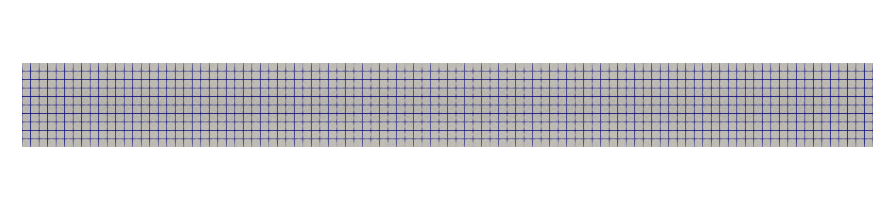
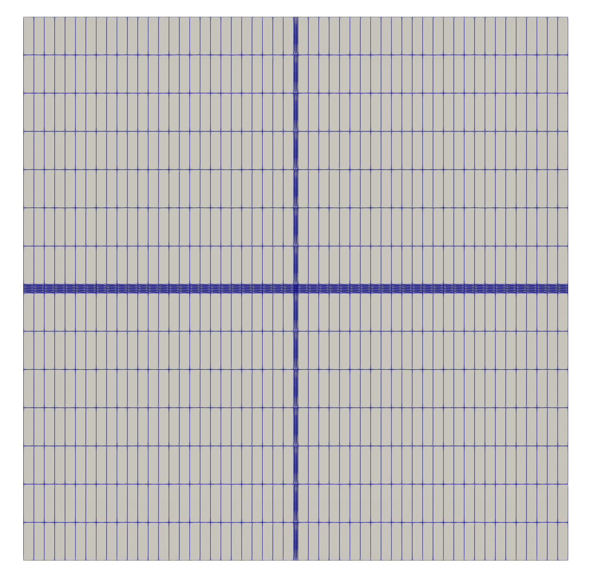
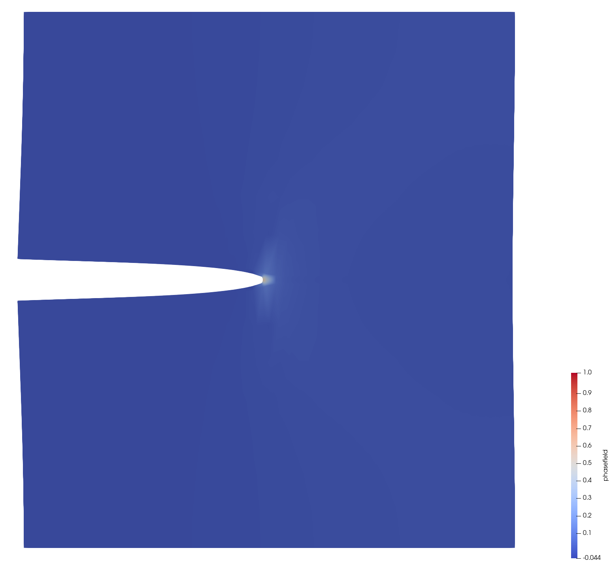
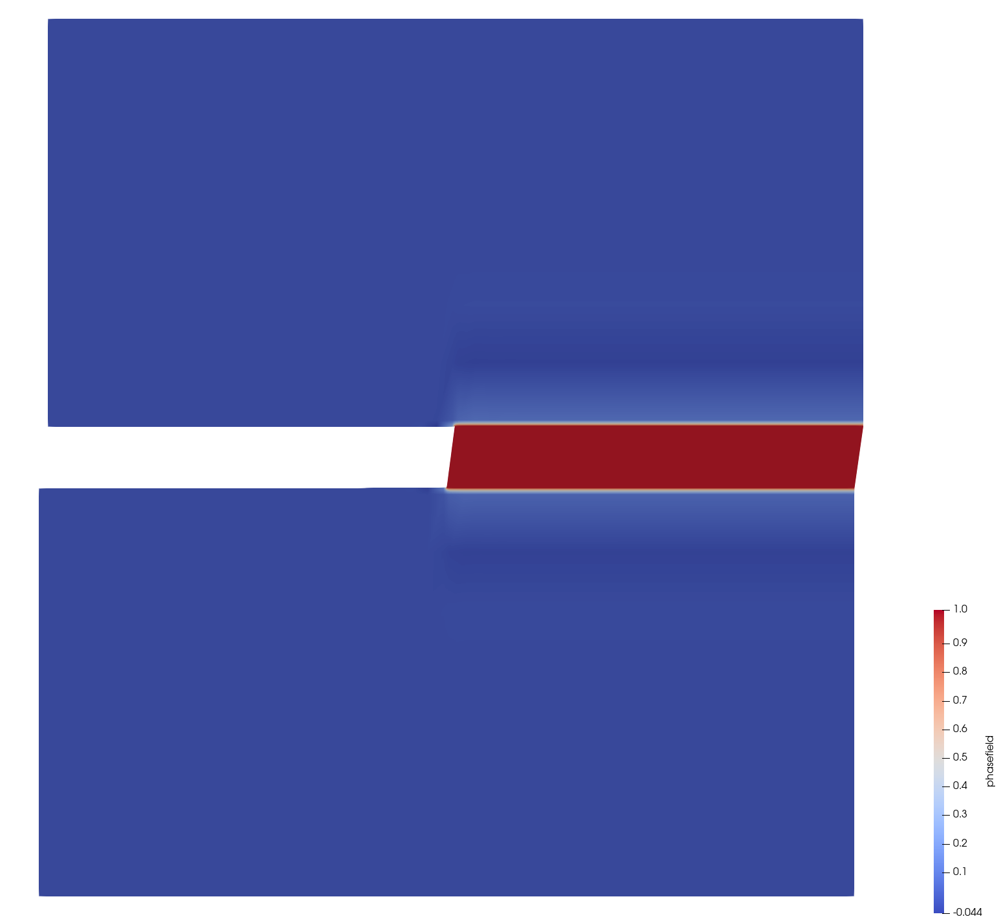
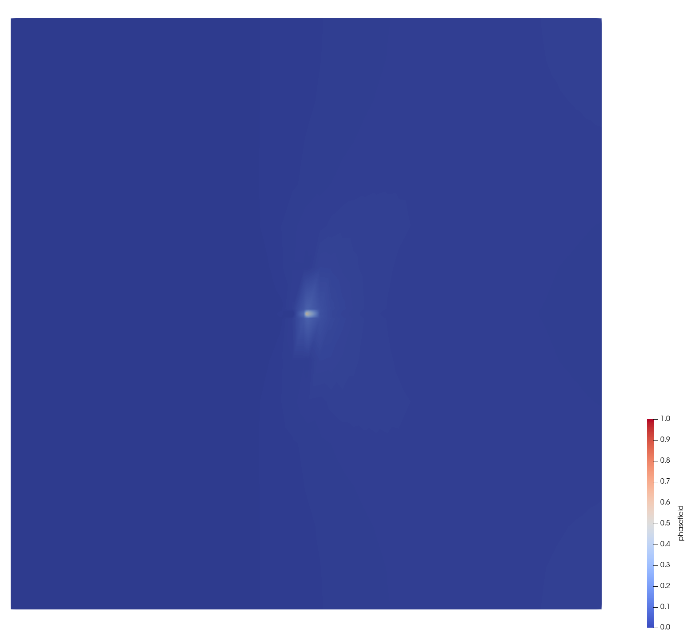
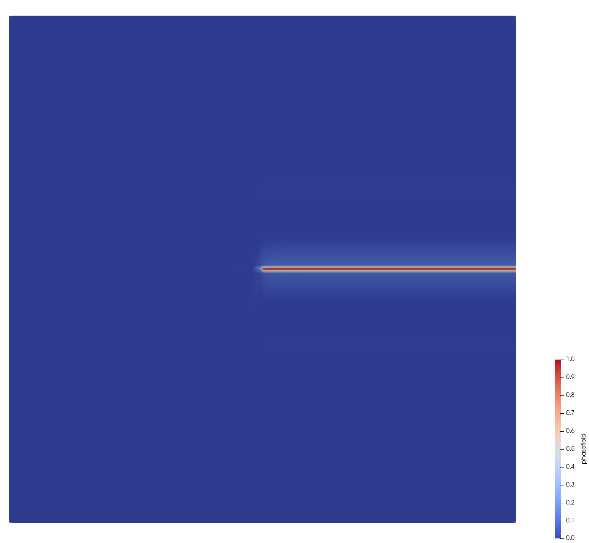
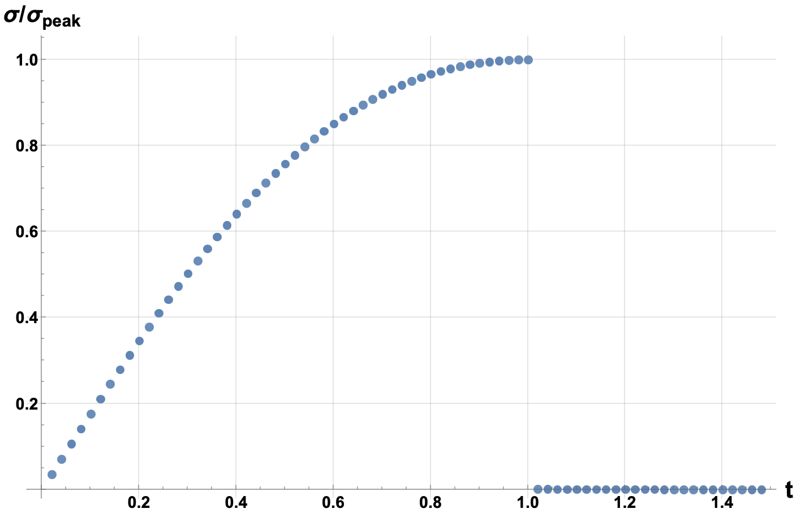
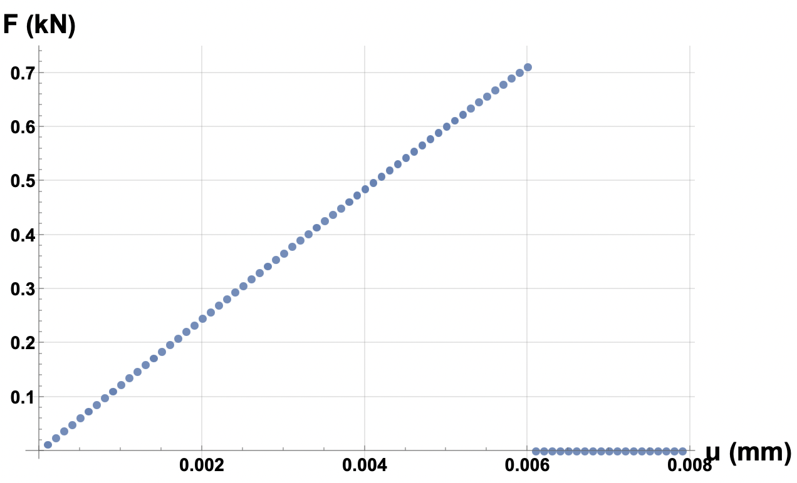

# phasefield-jr-boram
### Simple one-file C++ examples to run 2D phase field problems using a robust L-BFGS solver

### NOTE: The project has been ported to: [BORAM repository @ gfemuillinois](https://github.com/gfemuillinois/boram_bfgs)


This project provides simple C++ examples to solve 2D phase field problems using the BORAM solver. The BORAM solver implements a robust L-BFGS solver with line search as published on:

[Paper to be published](#)

Please reference the above papers if you use the BORAM in your research.

Additionally, the project includes a traditional alternate minimization solver for comparison purposes. Future work may involve combining and optimizing both solvers, together with over relaxation, to further enhance performance and robustness.

The project is based on the implementation of phase field available on [https://github.com/nathanshauer/phasefield-jr](https://github.com/nathanshauer/phasefield-jr) and carries all necessary licenses.

#### Implementation by:

* **Nathan Shauer** ([www.nathanshauer.com](http://www.nathanshauer.com)) - Phase-field code and integration w/ solver

* **Caio Ramos** ([cs-ramos@outlook.com](cs-ramos@outlook.com)) - BORAM solver

### Note on the name BORAM

BORAM has two meanings. Firstly, it is an acronym derived from the names **B**FGS, **O**ver **R**elaxated, and **A**lternate **M**inimization. Secondly, in Korean, Boram means "*worthwhile*".

## Configuration

The code has been tested on macOS and Ubuntu. For Windows users, it is recommended to use Windows Subsystem for Linux (WSL) to ensure compatibility.

### Downloading Eigen3

The only dependency of the project is Eigen3, which is used for most linear algebra tasks in the implementation. You can download Eigen3 from its official website or use a package manager to install it. For example, on Ubuntu, you can install it using:

```sh
sudo apt-get install libeigen3-dev
```

On macOS, you can use Homebrew:

```sh
sudo brew install eigen
```

Or macports:

```sh
sudo port install eigen3
```

Alternatively, you can download the source code from the [Eigen3 official website](https://eigen.tuxfamily.org/dox/GettingStarted.html) and follow the instructions to install it manually.

### Bulding on terminal

To configure the project using CMake, follow these steps:

1. Ensure you have CMake installed on your system.
2. Open a terminal and navigate to the project directory:
  ```sh
  cd /Users/MyName/phasefield-jr-boram
  ```
3. Create a build directory and navigate into it:
  ```sh
  mkdir build
  cd build
  ```
4. Run CMake to configure the project:
  ```sh
  cmake ..
  ```
5. Build the project:
  ```sh
  make
  ```

### Building on VSCode with CMake Tools

To build the project using Visual Studio Code with the CMake Tools extension, follow these steps:

1. Install Visual Studio Code from the [official website](https://code.visualstudio.com/).
2. Install the CMake Tools extension from the VSCode marketplace.
3. Open the project folder in VSCode:
  ```sh
  code /Users/MyName/phasefield-jr-boram
  ```
4. Open the Command Palette (Ctrl+Shift+P) and select `CMake: Configure`.
5. Choose the appropriate kit for your system (e.g., GCC, Clang).
6. Once the configuration is complete, open the Command Palette again and select `CMake: Build`.

## Running the examples

There are two examples in the project:

1. **Example 1: Bar under tension**
  - To run this example, execute the following command in the terminal:
    ```sh
    ./build/example1
    ```

2. **Example 2: Single-edge notch plate under tension**
  - To run this example, execute the following command in the terminal:
    ```sh
    ./build/example2
    ```

## Output in Paraview using vtk files
To visualize the output in ParaView using VTK files, follow these steps:

1. **Generate VTK files**: After running the examples, VTK files will be generated in the `output` directory. These files contain the simulation results and can be visualized using ParaView.

2. **Install ParaView**: If you don't have ParaView installed, you can download it from the [official website](https://www.paraview.org/download/).

3. **Open ParaView**: Launch ParaView on your system.

4. **Load VTK files**:
  - Click on `File` > `Open`.
  - Navigate to the `output` directory of the project.
  - Select the VTK file you want to visualize (e.g., `output_ex1_#.vtk` or `output_ex2_#.vtk`).
  - Click `Apply` to load the data.

5. **Visualize the data**: Use the various visualization tools in ParaView to explore the simulation results. You can adjust the display properties, apply filters, and create animations to better understand the phase field analysis.

### Example 1

The adopted mesh is uniform, with all elements having the same size.



Next are color plots of the phase field at the onset of propagation and after propagation.


### Example 2
The adopted mesh is created within the code for simplicity, featuring (simple) necessary refinement in the region where fracture will propagate.



Below are figures showing the opening fracture at the onset of propagation and after propagation using the warp by vector filter.



Next are color plots of the phase field at the onset of propagation and after propagation.



## Quantitative analysis using Mathematica notebooks

The project includes two Mathematica notebooks for quantitative analysis of the simulation results:

1. **Notebook 1: Analysis of Bar under Tension**
  - This notebook analyzes the results from the `example1` simulation.
  - Open the notebook `example1_timexsigma.nb` using Wolfram Mathematica
  - Follow the instructions within the notebook to import the data from the txt file and perform the analysis.
  - This notebook presents the plot of `sigma/sigma_peak x time`, where `sigma_peak` is calculated analytically

2. **Notebook 2: Analysis of Single-edge Notch Plate under Tension**
  - This notebook analyzes the results from the `example2` simulation.
  - Open the notebook `example2_pdelta.nb` using Wolfram Mathematica
  - Follow the instructions within the notebook to import the data from the txt file and perform the analysis.
  - This notebook presents the plot `Reaction force x imposed displacement`

To execute the notebooks:

1. Open the desired notebook (`example1_timexsigma.nb` or `example2_pdelta.nb`).
2. Execute each cell using `shift+enter`. You can also execute all cells by pressing `cmd+a` (`ctrl+a` in linux/windows) followed by `shift+enter`

### Example 1



### Example 2



## Future work

One of the key future directions for this project is to integrate the available solvers (the BORAM solver and the traditional alternate minimization solver) into a unified framework. This integration aims to leverage the strengths of both solvers, enhancing the overall performance and robustness of the solution process.
